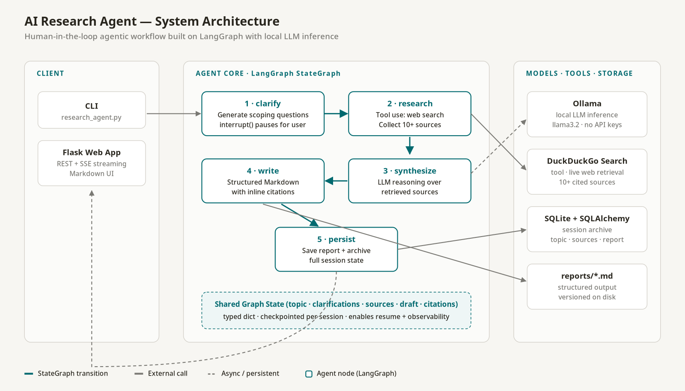

# AI Research Agent

> An agentic research system built with **LangGraph** — combines tool use, memory, human-in-the-loop clarification, and local LLM inference to generate source-cited Markdown reports on any topic.

[](https://www.python.org/)
[](https://github.com/langchain-ai/langgraph)
[](https://ollama.ai/)
[](https://flask.palletsprojects.com/)
[](LICENSE)

---

## Why this project

Most "AI research" demos hallucinate confidently and call it done. This project takes the opposite stance: **every claim in the output is tied to a retrieved source, every run is checkpointed, and the agent pauses to scope the question before spending tokens.** It is a small but honest implementation of the patterns real agentic systems need — tool use, orchestrated state, human-in-the-loop, and persistent memory — deliberately kept simple enough to read in one sitting.

Built as part of my applied agentic-AI work. A good companion piece alongside the rest of my portfolio at **[github.com/eboekenh](https://github.com/eboekenh)**.

---

## Demo

<!--
  To drop in a real demo GIF:
  1. Record the Flask app (http://localhost:5000) while running a query end-to-end.
     macOS: QuickTime → File → New Screen Recording, or LICEcap (https://www.cockos.com/licecap/)
     Linux: peek (https://github.com/phw/peek) or Kooha
  2. Convert/trim to a web-friendly GIF:
       ffmpeg -i demo.mov -vf "fps=12,scale=1000:-1:flags=lanczos" -loop 0 docs/demo.gif
  3. Replace the architecture image reference below with:  
-->



A recorded demo (`docs/demo.gif`) will replace the diagram above; see the comment in this file for the exact capture + `ffmpeg` recipe.

---

## What it does

```
User enters topic
   ↓
Agent generates clarifying questions  ──  LangGraph  interrupt()
   ↓                                        (pauses the graph)
User answers
   ↓
Agent searches the web (10+ sources via DuckDuckGo)
   ↓
Agent synthesizes findings through a local LLM (Ollama)
   ↓
Agent writes a structured Markdown report with inline citations
   ↓
Session state + report persisted to SQLite and /reports
```

**Core capabilities**

| | |
|---|---|
| **Human-in-the-loop** | The graph pauses with `interrupt()` / resumes with `Command(resume=...)` — the agent refuses to guess scope |
| **Tool use** | DuckDuckGo search as a first-class tool; results feed the next graph node |
| **Local inference** | Runs entirely through Ollama — no API keys, no data leaves the host |
| **Memory / persistence** | Typed graph state checkpointed per session; full history archived in SQLite |
| **Source-grounded output** | Inline citations, sources list, and reproducible Markdown reports on disk |
| **Dual interface** | CLI for power users; Flask web app with SSE streaming for progress + rendered output |

---

## Architecture


The agent is a LangGraph `StateGraph` with five nodes. Each transition reads and writes a shared, typed state dict — which is what enables resume, observability, and clean separation between orchestration, model calls, and tool use.

| Node | Responsibility | Key primitives |
|------|----------------|----------------|
| **1 · clarify** | Generate 2–3 scoping questions, pause for the user | `interrupt()` / `Command(resume=)` |
| **2 · research** | Query DuckDuckGo, collect ≥10 sources, attach to state | Tool-calling pattern |
| **3 · synthesize** | LLM reasoning over retrieved sources | Ollama via `langchain-ollama` |
| **4 · write** | Render structured Markdown with inline citations | Prompt template + sources |
| **5 · persist** | Save report to disk + full session to SQLite | SQLAlchemy session |

State shape (simplified):

```python
class ResearchState(TypedDict):
    topic: str
    clarifications: list[str]
    sources: list[Source]        # url · title · snippet
    draft: str
    citations: list[Citation]
    session_id: str
```

---

## Quick start

### Prerequisites
- Python 3.10+
- [Ollama](https://ollama.ai/) installed and running locally

### Install

```bash
git clone https://github.com/eboekenh/research_agent.git
cd research_agent
pip install -r requirements.txt
ollama pull llama3.2:3b
```

### Run — CLI

```bash
python research_agent.py
```

You'll be prompted for a topic, then asked clarifying questions, then shown the final report path.

### Run — Web app

```bash
python web_app/app.py
# open http://localhost:5000
```

The web UI adds:
- Live SSE progress ("searching", "synthesizing", "writing")
- Rendered Markdown with copy + download
- Searchable history sidebar (all past sessions)

---

## Configuration

| Variable | Default | Description |
|---|---|---|
| `OLLAMA_MODEL` | `llama3.2:3b` | Any Ollama-available model (e.g. `llama3.1:8b`, `mistral`) |
| `DATABASE_URL` | `sqlite:///research_agent.db` | SQLAlchemy connection string |
| `SEARCH_MAX_RESULTS` | `10` | Number of web sources collected per run |

Example:

```bash
OLLAMA_MODEL=llama3.1:8b python research_agent.py
```

Copy `.env.example` to `.env` for a project-local override.

---

## Project structure

```
├── graph.py                    # LangGraph StateGraph — orchestration core
├── research_agent.py           # CLI entry point
├── db.py                       # SQLAlchemy models + session helpers
├── web_app/
│   ├── app.py                  # Flask REST + SSE server
│   ├── templates/index.html    # Single-page UI
│   └── static/style.css
├── tests/
│   └── test_graph.py           # Graph-level tests
├── reports/                    # Generated Markdown reports
├── docs/
│   ├── architecture.png        # System diagram (this README)
│   ├── TECHNICAL_DOCUMENTATION.md
│   └── BUSINESS_REPORT.md
├── .env.example
└── requirements.txt
```

---

## Design decisions worth calling out

- **Local LLM by default.** Using Ollama keeps the cost and privacy story clean — useful for anyone running this against sensitive topics. Swapping to a hosted model is a one-line change.
- **Human-in-the-loop is the *first* node, not an afterthought.** Most "research agent" demos skip clarification and pay for it in wasted retrieval. The `interrupt()`/`Command(resume=)` pattern is cheap to implement and dramatically improves output quality.
- **Typed state instead of a grab-bag dict.** The `ResearchState` TypedDict makes the graph readable and makes future nodes easy to plug in.
- **Separation of orchestration (graph.py), interface (CLI / Flask), and persistence (db.py).** Each layer is independently testable; `tests/test_graph.py` exercises the graph without needing a live LLM.
- **Report artifacts are first-class.** Reports land in `reports/` as versioned Markdown *and* in SQLite — one for humans, one for programmatic retrieval.

---

## Extending the agent

Common extension points and where to start:

| Goal | Change |
|---|---|
| Add a new tool (e.g. arXiv, internal wiki) | Add a node in `graph.py` and route from `research` |
| Swap the LLM provider | Replace the `langchain-ollama` client in `graph.py` |
| Add evaluation / scoring | Add a `score` node after `write` and persist metrics in `db.py` |
| Add multi-agent critique | Add a `critique` subgraph between `write` and `persist` |

---

## Tech stack

| Layer | Choice |
|---|---|
| Orchestration | [LangGraph](https://github.com/langchain-ai/langgraph) `StateGraph` with `interrupt()` / `Command(resume=)` |
| LLM runtime | [Ollama](https://ollama.ai/) (local) via [`langchain-ollama`](https://python.langchain.com/docs/integrations/llms/ollama/) |
| Retrieval tool | [DuckDuckGo Search](https://pypi.org/project/duckduckgo-search/) |
| Backend | [Flask](https://flask.palletsprojects.com/) + Server-Sent Events |
| Storage | [SQLite](https://www.sqlite.org/) + [SQLAlchemy](https://www.sqlalchemy.org/) |
| Frontend | Vanilla JS + [marked.js](https://marked.js.org/) |

---

## Further reading

- **[Technical documentation](docs/TECHNICAL_DOCUMENTATION.md)** — architecture deep-dive, API reference, design decisions
- **[Business report](docs/BUSINESS_REPORT.md)** — problem framing, use cases, ROI analysis
- **[Contributing](CONTRIBUTING.md)**  ·  **[Changelog](CHANGELOG.md)**

---

## License

MIT — see [LICENSE](LICENSE).

---

<p align="center">
  Built by <a href="https://github.com/eboekenh">Ecem Bökenheide</a>  ·  Berlin, Germany<br/>
  <sub>Part of a broader portfolio on applied agentic AI, evaluation, and prototype-to-product engineering.</sub>
</p>
